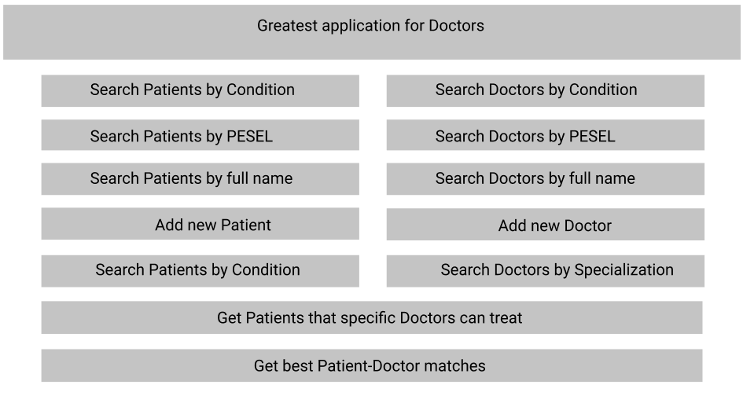
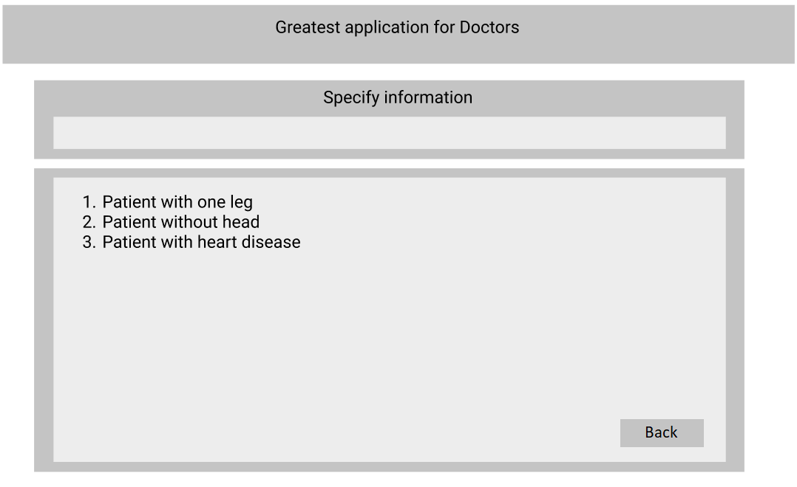

## Projekt aplikacji dla Doktorów

--------------------------------------

##### Autorzy:

###### Maciej Włodarczyk

######  Marcin Dadura

-------------------------

### 1. Funkcjonalność

Aplikacja powinna pozwalać:

* dodawać pacjentów,
* dodawać doktorów,
* wyświetlać grupy pacjentów na podstawie wszystkich ich danych,
* wyświetlać grupy doktorów na podstawie wszystkich ich danych,
* znajdować najlepsze dopasowanie doktorów do pacjentów.

### 2. Widok aplikacji

Zdefiniowaliśmy dwa widoki aplikacji:

 * **Widok główny** - widok pokazujący wszystkie możliwe akcje dla użytkownika.
 * **Widok danych** - widok pojedyńczej akcji.

### 2.1 Widok główny

Prosty projekt widok głównego.

Widok główny pokazuje wszystkie możliwe akcje dla doktora. Doktor może za pomocą różnych parametrów wyświetlić dane dotyczące doktorów, dane dotyczące pacjentów oraz dodawać ich. Doktor może również otrzymać najlepsze przypisanie doktorów do pacjentów oraz dostać listę pacjentów, których jest w stanie wyleczyć dany doktor, takie zapytanie generowane jest na podstawie     `id` doktora.

### 2.1 Widok danych

Poglądowy projekt widoku danych.

W tym widoku doktor realizuje dana akcje. Jest tu pole na input od klienta, dzięki czemu będzie mógł prowadzić interakcję z aplikacją. Z tego widoku klient może wrócić do głównego widoku. Lekko zmodyfikowane wersje tego widoku bedą służyć do realizacji wszystkich zapytań udostępnionych klientowi, w tym dodawanie danych.

