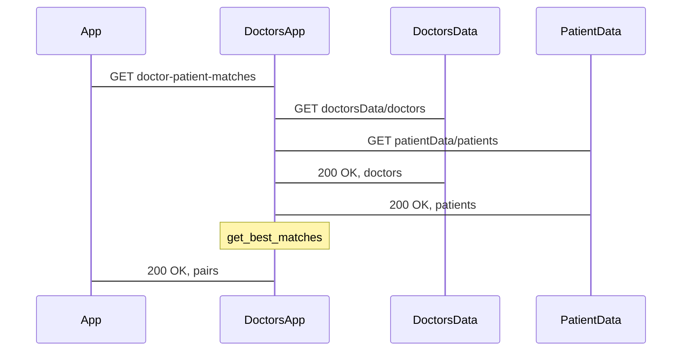

## Dokumentacja mikrousługi aplikacyjnej DoctorApp

--------------------------------------

##### Autorzy:

###### Maciej Włodarczyk

######  Marcin Dadura

-------------------------

### 1. Cel

Mikrousługa DoctorApp ma za zadanie dostarczyć interfejs REST, który korzysta z mikrousług `data`. Interfejs dostarcza metody, które przetwarzają dane dostarczone prze mikrousługi danych na interfejsie REST. Interfejs powinien być przejrzysty oraz nie ujawniać szczegółów implementacji.


### 2. API

Usługa wystawia interfejs z którego można korzystać za pomocą HTTP REST.

Usługa wystawia następujące metody na punktach końcowych:

* metody `GET`:
  * `/patients` - zwraca listę wszyskich pacjentów dostępnych w repozytorium danych, nie przyjmuje argumentów
  * `/patient/{id}` - metoda zwracająca pacjenta o danym id, przyjmuje liczbę całkowitą jako ID pacjenta
  * `/patient/condition/{condition}` - metoda zwracająca listę pacjentów z danymi schorzeniami, przyjmuje liczbę całkowitą, jako typ schorzenia
  * `/patient/pesel/{pesel}` - metoda zwracająca pacjenta o danym peselu, przyjmuje stringa jako Pesel
  * `/doctors` - zwraca listę wszyskich doktorów dostępnych w repozytorium danych, nie przyjmuje argumentów
  * `/doctor/{id}` - metoda zwracająca doktora o danym id, przyjmuje liczbę całkowitą jako ID doktora
  * `/doctor/specialization/{specialization}` - metoda zwracająca listę doktora z danymi specjalizacjami, przyjmuje liczbę całkowitą, jako specjalizację
  * `/doctor/pesel/{pesel}` - metoda zwracająca doktora o danym peselu, przyjmuje stringa jako Pesel
  * `/doctor/{id}/can-treat` - metoda zwracająca pacjentów, których może wyleczyć dany pacjent, pprzyjmuje id doktora
  * `/doctor-patient-matches` - metoda zwracająca najlepsze przypisanie doktorów do pacjentów


* metoda `POST`:
  * `/patient` - wysyłając obiekt json metoda ta pozwala na dodanie pacjenta
  * `/doctor` - wysyłając obiekt json metoda ta pozwala na dodanie doktora


### 3. Struktura projektu


```
DoctorsApp
├── App
│   ├── .dockerignore - plik mówiący dokerowi o plikach które należy pominąc przy budowaniu obrazu
│   ├── .gitignore - plik mówiący repozytorium o plikach ignorowanych
│   ├── Dockerfile - plik umożliwiający konteneryzację
│   ├── DoctorsApp.csproj - plik zawierający wszystkie info o projekcie, w tym używane pakiety
│   ├── Program.cs - znajduje się tutaj funkcja wejściowa do programu
│   ├── Properties 
│   │   └── launchSettings.json  - plik JSON z ustawieniami łądowanymi przy uruchomieniu aplikacji
│   ├── Startup.cs - klasa zajmująca cię wstepną konfiguracją mikrousługi przy uruchomieniu
│   ├── Web
│   │   ├── Application
│   │   │   ├── DataServiceClients
│   │   │   │   ├── DoctorsDataServiceClient.cs - klasa komunikująca sie z API mikrousługi danych lekarzy
│   │   │   │   ├── IDoctorsDataServiceClient.cs - interfejs, który implementuje metody zapytań do mikrousługi danych lekarzy
│   │   │   │   ├── IPatientsDataServiceClient.cs - interfejs, który implementuje metody zapytań do mikrousługi danych pacjentów
│   │   │   │   └── PatientsDataServiceClient.cs - klasa komunikująca sie z API mikrousługi danych pacjentów
│   │   │   ├── Dtos
│   │   │   │   ├── ConditionDto.cs -  model do wysyłania danych o schorzeniach
│   │   │   │   ├── DoctorDto.cs -  model do wysyłania danych o lekarzach
│   │   │   │   ├── PatientDto.cs - model do wysyłania danych o pacjentach
│   │   │   │   └── SpecializationDto.cs -  model do wysyłania danych o specjalizacjach
│   │   │   │   └── PatientDoctorDto.cs - model do przytrzymawania par doktor-pacjent
│   │   │   └── Queries
│   │   │       ├── DoctorQueryHandler.cs - klasa zajmująca się obsługą zapytań dotyczących doktorów - przekazuje ona zapytania klienta http.
│   │   │       ├── IDoctorsQueryHandler.cs - interfejs, który implementuje obsługę zapytań dla lekarzy.
│   │   │       ├── IPatientsQueryHandler.cs - interfejs, który implementuje obsługę zapytań dla pacjentów.
│   │   │       ├── ISelectorQueryHandler.cs - interfejs, który implementuje obsługę złożonych zapytań dotyczących lekarzy i pacjentów.
│   │   │       ├── PatientsQueryHandler.cs - klasa zajmująca się obsługą zapytań dotyczących pacjentów - przekazuje ona zapytania do klienta http.
│   │   │       └── SelectorQueryHandler.cs - klasa zajmująca się obsługą złożonych zapytań dotyczących jednoczesnie pacjentów i lekarzy - przekazuje ona zapytania do klienta http.
│   │   ├── Configuration
│   │   │   └── ServiceConfiguration.cs - klasa zapewniająca url potrzebne dla klienta http
│   │   ├── Controllers
│   │   │   └── DoctorsAppController.cs  - kontroler odpowiedzialny za obsługę end-pointów zdefiniowanych w usłudze - wywołuje on metody z *QueriesHandler.cs.
│   │   └── Logic
│   │       └── Selector 
│   │           └── PatientSelector.cs - klasa zapewniająca metody wykonujące obliczenia na danych 
│   ├── appsettings.Development.json  - ustawienia aplikacji dla stanu Development
│   └── appsettings.json  - ustawienia aplikacji dla stanu Release
├── DoctorsApp.sln - plik opisujący rozwiązanie
└── Test
├── DoctorsAppTests.bat - skrypt testujący dla windowsa
└── DoctorsAppTests.sh - skrypt testujacy dla linuxa
```


Zapytania obsługiwane są w następującym schemacie. Zapytanie przechwytuje `controller` i przekazuje je do `QueryHandlera`.  `QueryHandler` pobiera dane za pośrednictwem `DataService` i działa na obiektach `Data Transfer Object` oraz zwraca je do `Controllera`, który wystawia dane na wyjście.


### 3. Diagram sekwencji wiadomości


#### metody `GET`:
#####    `/patients`


##### `/patient/{id}`


##### `/patient/condition/{condition}`


##### `/patient/pesel/{pesel}`


##### `/doctors`


##### `/doctor/{id}`


##### `/doctor/specialization/{specialization}`


##### `/doctor/pesel/{pesel}`


##### `/doctor/{id}/can-threat`


##### `/doctor-patient-matches`





<br/><br/><br/>

#### metoda `POST`:

##### `/patient`


##### `/doctor`


### 4. Testy


Do mikrousługi zostały dostarczone również testy w postaci skryptu `curl`. Aplikacja przechodzi testy i spełnia swoją funkcjonalność. Testy można odnaleźc w `DoctorsApp/Test/PatientDataTests.bat`.
